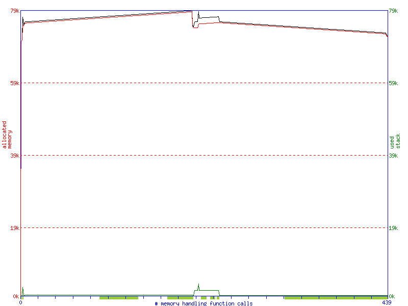
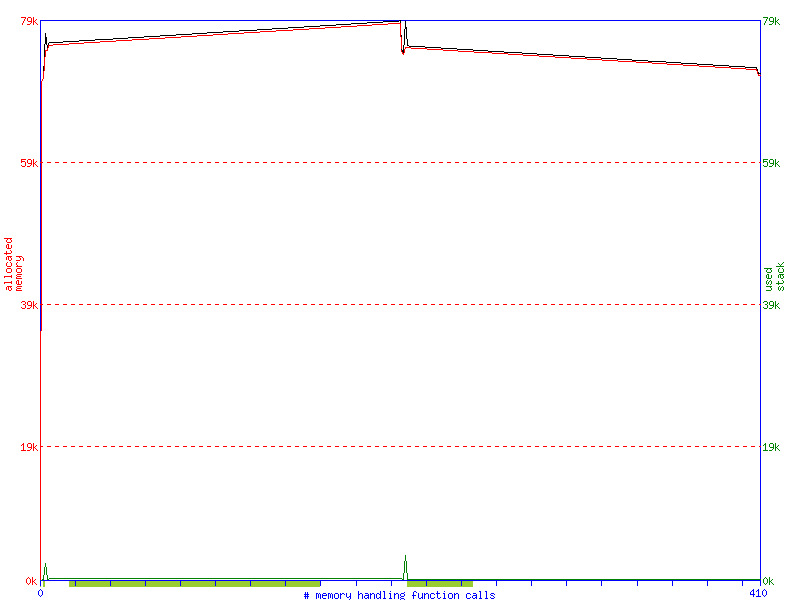
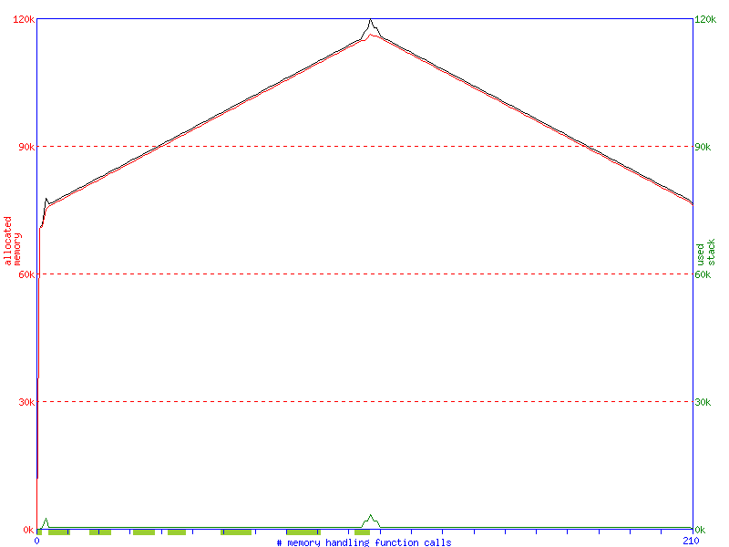
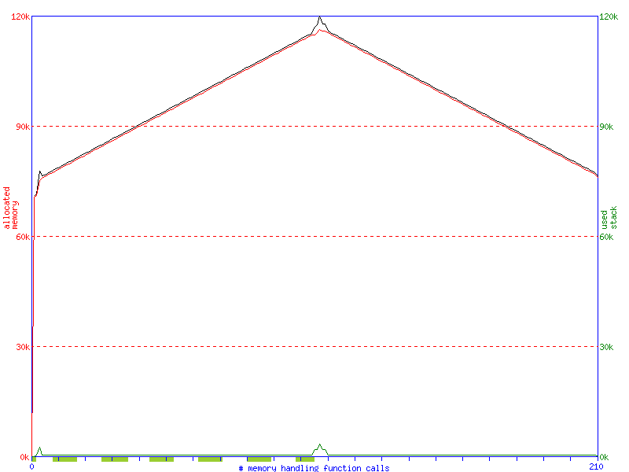
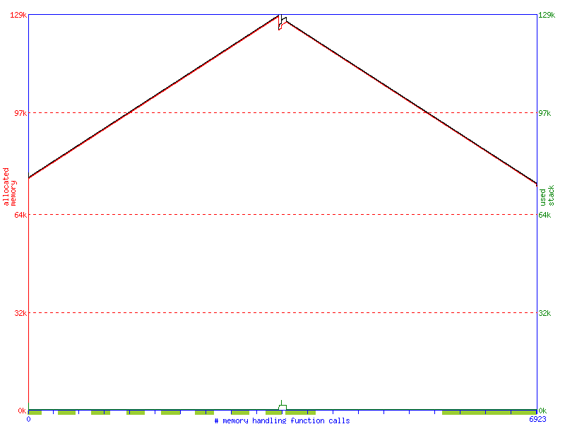
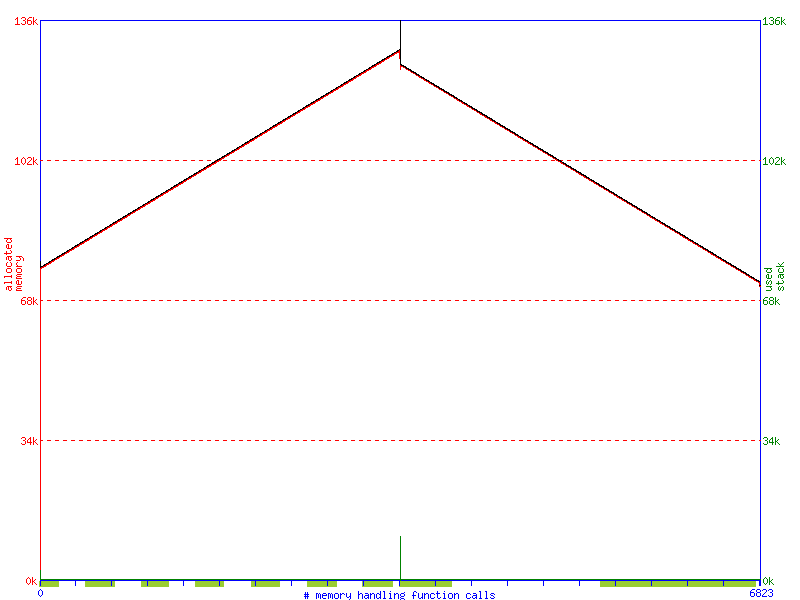
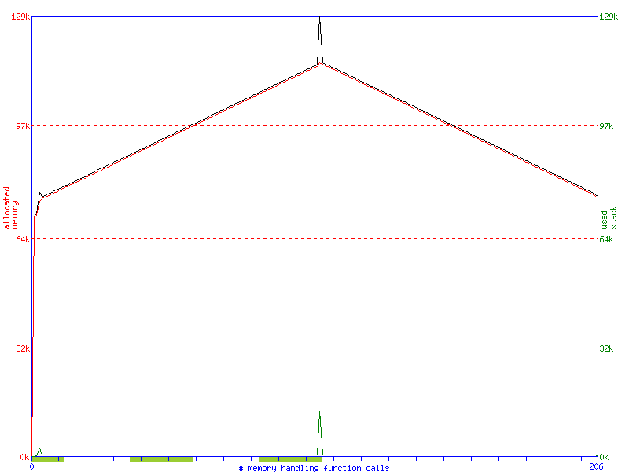
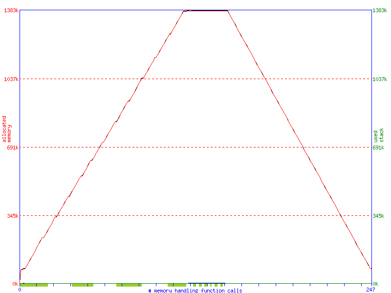
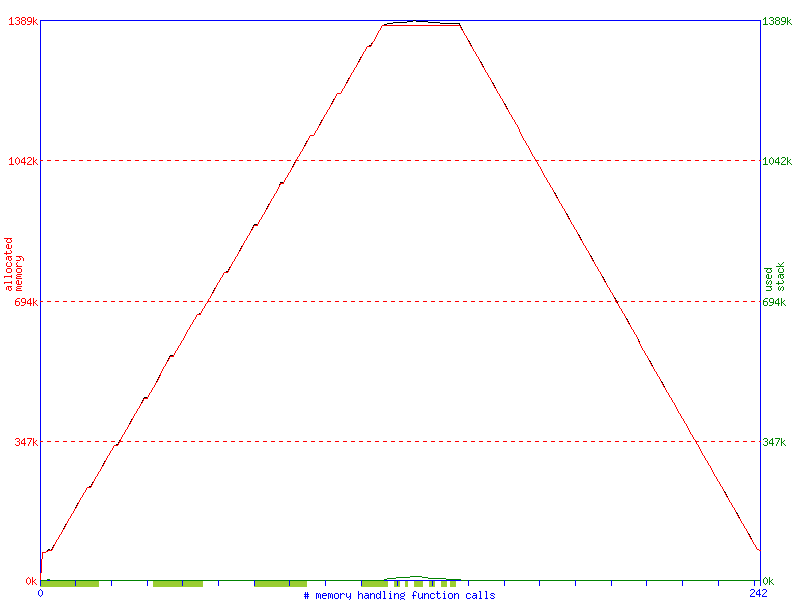

# Estruturas de representação de grafos

Este repositório visa apresentar os métodos BFS e DFS, vistos no livro do Cormen implementados como *lista de adjacência*, em matrizes de adjacência e incidência.


## Resumo

O objetivo é adaptar as funções BFS (busca em largura) e DFS (busca em profundidade), apresentadas inicialmente para listas de adjacências, para matrizes de adjacência e matrizes de incidências, que são outras formas de representar grafos. Além disso, será feita uma análise de desempenho, tanto em tempo de execução quanto em uso de memória.

O software foi escrito em C++ com o uso de classes para representar os grafos e seus métodos. Para a criação dos grafos foi utilizado matrizes dinamicamente alocadas usando *smart pointers* para a sua construção, assim facilitando a manipulação da memória.

# Compilação

Para compilar esse programa é necessário ter o gcc >= 10.2.0 

```
$ git clone https://github.com/Numb4r/Representacao-Grafos.git Graph
$ cd Graph
$ make
```

Esse repositório também acompanha o código da *lista de adjacência* com os métodos BFS e DFS separados por arquivos.

```
$ cd ListAdj
$ g++ BFS.cpp -o BFS
$ g++ DFS.cpp -o DFS
```

Para poder executar o programa é necessário de um arquivo **.txt** com as informações para gerar o grafo. O formato do arquivo *txt* é o seguinte:

```
NumerodeVertices NumerodeArestas
VerticeOrigem VerticeDestino
VerticeOrigem VerticeDestino
VerticeOrigem VerticeDestino
VerticeOrigem VerticeDestino
VerticeOrigem VerticeDestino
```
Por exemplo, o arquivo:
```
4,3
0,2
1,3
2,2
```
Irá criar um grafo com 4 vértices e 3 arestas.

O script **GraphRandom.sh** permite gerar um grafo randômico para teste passando como parâmetro o número de vértices e o número de arestas.

```
$ ./GraphRandom.sh 10 14
```
A execução acima irá gerar um grafo com 10 vértices e 14 arestas. Além disso, o script irá gerar um arquivo **.dot** e a partir dele uma imagem representativa do grafo.

Após gerar os arquivos, será possível executar o programa principal rodando um ``$ make run``. Para os métodos relacionados a *lista de adjacência*, basta executar o binário gerado dentro da pasta *ListAdj*.


## Adaptações

Foram feitas algumas pequenas mudanças nos métodos BFS e DFS para se utilizar matrizes de adjacência e incidência.

Uma das principais mudanças dos métodos adaptados para matrizes, em relação ao código apresentado em [ListAdj](https://github.com/Numb4r/Representacao-Grafos/tree/master/ListAdj), é o parâmetro da função ser do tipo ``int`` em vez de um tipo ``Vertex``. Isso porque, para matrizes, é necessário apenas o valor numérico para identificação do vértice.


### BFS

As mudanças no método se concentra dentro do *loop*  ``while``.

No caso de *lista de adjacência*, é necessário percorrer a lista do vértice retirado da fila para que ache todos os vértices que ele faz conexão.


```
Item *u = Dequeue(f);
for(Vertex v = G->adj[u->data]; v != NULL; v=v->prox){
    if(cor[v->value] == 0){
        cor[v->value] = 1;
        d[v->value]   = d[u->data] + 1;
        pi[v->value]  = u->data;
        Queue(f, v->value);
    }
}
```


No caso de *matriz de adjacência*, é necessário percorrer a linha V da matriz, dado um vértice V retirado da fila, para que ache quais são os vértices que ele faz a ligação. Não se diferencia muito do método da *lista de adjacência*, necessitando apenas uma verificação *linhaXcoluna* dentro da matriz, onde a linha é o vértice origem e a coluna o de destino, que deve possuir 1 marcado para simbolizar a ligação entre os dois.

A representação de uma conexão de um vértice origem *V* para um vértice destino *M* é a seguinte:

|/  | 1 | 2 | - | V | U |
|---|---|---|---|---|---|
| 1 | 0 | 0 | - | 0 | 0 |
| 2 | 0 | 0 | - | 0 | 0 |
| - | - | - | - | - | - |
| V | 0 | 0 | - | 0 | 1 |
| U | 0 | 0 | - | 0 | 0 |

```
int VertexHolder = queue.front();
queue.pop();

for (int i = 0; i < this->numberVertex; i++)
{
    if (this->matrix[VertexHolder][i] == 1 && color[i] == WHITE)
    {
        color[i] = GREY;
        tDiscovery[i] = tDiscovery[VertexHolder] + 1;
        pi[i] = VertexHolder;
        queue.push(i);
    }
    
}
```

A *matriz de incidência* possui uma estrutura diferente da *matriz de adjacência*, que normalmente resulta em uma matriz não quadrada. Isso é causado pela natureza dessa estrutura, que se dá por *NxM*, onde *N* são os vértices e *M* são as arestas. Isso resulta em duas estruturas de repetição aninhadas para busca da conexão, onde a mais externa procura as arestas que *"sai"* do vértice de origem V , simbolizado na matriz por 1, e a mais interna procura o vértice destino U, simbolizado por -1.

A representação de uma conexão de um vértice origem *V* para um vértice destino *U*, usando a aresta *eK*, é a seguinte:

| / | e1| e2| - | eK|
|---|---|---|---|---|
| 1 | 0 | 0 | - | 0 |
| 2 | 0 | 0 | - | 0 |
| - | - | - | - | - |
| V | 0 | 0 | - | 1 |
| U | 0 | 0 | - | -1|

```
int vertexHolder = queue.front();
queue.pop();
for (int i = 0; i < numberEdges; i++)
{
    if (matrix[vertexHolder][i] == 1)
    {
        for (int destV = 0; destV < numberVertex; destV++)
        {
            if (matrix[destV][i] == -1 && color[destV] == WHITE)
            {
                color[destV] = GREY;
                tDiscovery[destV] = tDiscovery[vertexHolder] + 1;
                pi[destV] = vertexHolder;
                queue.push(destV);
            }
            
        }
    }
    
}
```

### DFS

As mudanças do algoritmo DFS se concentram na função auxiliar *DFSVisit*, o método *DFS* permanece sem alterações no seu funcionamento básico.

O funcionamento do *DFS_VISIT* se assemelha em todas as estruturas. No caso da *lista de adjacência*, será percorrido a lista do vértice V e verificado todos os vértices que ele faz conexão.


```
for(Vertex u = G->adj[v->value]; u != NULL; u=u->prox)
	if(cor[u->value] == 0)
		DFS_VISIT(G, u, cor, d, f, tempo);
```

No caso de uma *matriz de adjacência*, deverá percorrer a linha da matriz do vértice de origem V e verificar suas conexões com os vértices de origem, simbolizadas por 1.


```
for (int i = 0; i < this->numberVertex; i++)
    if(matrix[vertex][i] == 1 & color[i] == WHITE)
        DFSVisit(i,color,tDiscovery,tCompletion,time);
```


Na *matriz de incidência* o método difere um pouco. Assim como no método *BFS*, será necessário de *loop* de repetição aninhados para verificar o vértice de origem V, simbolizado por 1, e o vértice de destino U, simbolizado por -1.

```
for (int i = 0; i < numberEdges; i++)
{
    if (matrix[vertex][i] == 1)
    {
        for (int j = 0; j < numberVertex; j++)
        {
            if (matrix[j][i] == -1 && color[j] == WHITE)
            {
                DFSVisit(j,color,tDiscovery,tCompletion,time);
            }
            
        }
        
    }
}
```

## Testes

Foram executados testes de memória e tempo de execução de ambos os métodos de busca em todas as estruturas de representação com o fim de comparação de desempenho.

Os testes foram feitos com grafos esparsos e densos, com no mínimo de 100 vértices.
Para gerar os grafos foi usado o script [GraphRandom.sh](https://github.com/Numb4r/Representacão-Grafos/blob/master/GraphRandom.sh).
Os grafos para os testes entre tempo e memória são os mesmos.

### Tempo

Todos os resultados são apresentados em segundos e calculados pela média aritmética de, no mínimo, 3 execuções usando o comando UNIX `time` para o cálculo do tempo.

#### Esparso
Foi utilizado um grafo com 100 vértices e 30 arestas. Para o método *BFS* foi considerado como início o vértice com maior número de adjacências.


|                   |BFS|DFS|
|---                |---|---|
|Lista Adjacência   |0.002|0.002|
|Matriz Adjacência  |0.0025|0.0035|
|Matriz incidência  |0.0025|0.003|

Como podemos perceber, embora a diferença entre as estruturas matriciais sejam mínimas, listas de adjacência possuem uma pequena vantagem. Isso se dá graças à necessidade de verificar posições não relevantes em estruturas matriciais.


### Denso

Foi utilizado um grafo com 100 vértices e 3333 arestas, dada a fórmula E(V) = (V^2)/3,com V sendo número de vértices e E(V) o número de arestas. Para o método *BFS* foi considerado o vértice 0 como início.

|                   |BFS|DFS|
|---                |---|---|
|Lista Adjacência   |0.0035|0.004|
|Matriz Adjacência  |0.004|0.0045|
|Matriz incidência  |0.0038|0.038|

Como podemos notar, listas e matrizes de adjacência não divergem muito dos seus resultados. Além disso, dado a quantidade expressiva de informações extras que o grafo possui (33.33 vezes o número de  arestas), não ocorreu um aumento significativo em tempo de execução. Mas podemos perceber que matrizes de adjacência começam a se mostrar vantajosas quando grafos se tornam mais densos, já que a diferença de tempo para grafos esparsos cresceu em uma taxa menor.

Matriz de incidência mostrou um resultado desastroso. Enquanto as matrizes de adjacência possuem dimensões 100x100 no teste feito, as de incidência possuem 100x3333, o que resulta no seu péssimo tempo de execução.

### Tempo

Junto com o teste de tempo, foram realizados testes de memória com os mesmos grafos, esparsos e densos, a fim de comparar a quantidade de uso de cada estrutura de representação e como cada algoritmo faz o uso dela. Foi utilizado o programa `memusage` com a flag *-T* para gerar os gráficos. O primeiro gráfico de cada estrutura executa o algoritmo BFS enquanto o segundo executa o DFS.

#### Esparso
- Lista de Adjacência
    
      
- Matriz de Adjacência 
    
    
- Matriz de Incidência
    
    

#### Denso
- Lista de Adjacência
    
      
- Matriz de Adjacência 
    
    
- Matriz de Incidência
    
    

Como podemos ver, embora *Lista de Adjacência* consuma menos memória em um grafo esparso, novamente a estrutura *Matriz de Adjacência* se mostra benéfica quando se tem muitas conexões. *Matriz de Incidência* continua sendo a estrutura menos interessante em termos de desempenho geral.

## Conclusão
 
Após testes exaustivos podemos chegar a algumas inferências. A estrutura *Lista de Adjacência* leva vantagem quando tratamos de grafos de esparsos, tanto em tempo de execução quanto em quantidade de memória utilizada. Isso se dá pela sua estrutura simplista, onde salva apenas o necessário de cada vértice em uma lista vinculada ao mesmo. Porém, quando crescemos o número de conexões, *Matriz de Adjacência* começa a se mostrar mais benéfica. Possuindo estrutura matricial *NxN*, ela apenas precisa expandir caso sejam criados novos vértices, além de possuir um tempo linear para acesso de seus elementos. Já *Matriz de Incidência* se mostrou problemática em todos os testes, possuindo tempo e custo de memória semelhante a outra estrutura matricial em grafos esparsos (isso se dá pelo fato que foi gerado coincidentemente uma matriz *NxN*, o que nem sempre é o caso), mas tendo desempenho péssimo quando passamos para grafos densos.